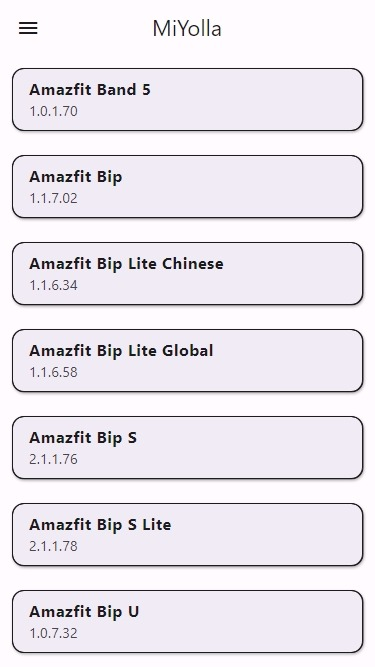
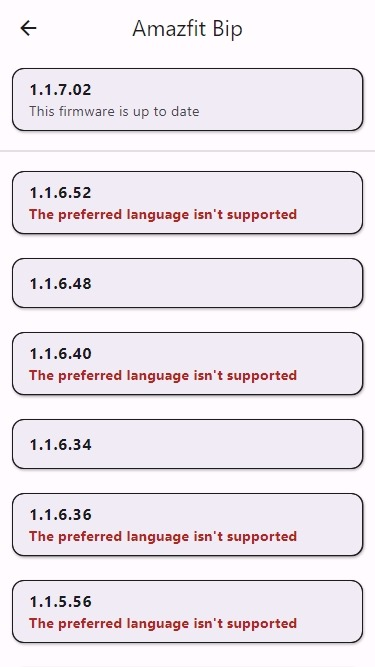

# MiYolla
Firmwares for Huami wearables

### Description:
The MiYolla app can download different firmware versions for many Huami wearables:
* Amazfit
* Xiaomi Mi Band
* Zepp

### Screenshots:
 

### Features:
1. Simple UI
2. Many wearable devices
3. Different firmware versions
4. Fast data loading
5. Seven built-in app languages
6. Light and dark app modes
7. Multiple platforms are supported
8. WEB version is PWA

### Usage:
1. Choose a wearable device
2. Select the desired firmware version
3. Install unofficial app:
    * Android
        * [Gadgetbridge](https://gadgetbridge.org/)
        * [Notify for Amazfit & Zepp](https://play.google.com/store/apps/details?id=com.mc.amazfit1)
        * [Notify for Mi Band](https://play.google.com/store/apps/details?id=com.mc.miband1)
        * [Mi Bandage for Mi Band & Amazfit](https://play.google.com/store/apps/details?id=hu.tiborsosdevs.mibandage)
    * iOS
        * [AmazTools](https://amaztools.app/)
4. [Get an auth key](https://mmk.pw/en/xiaomikey/) if the application doesn't want to connect to the device without it
5. Install new firmware via unofficial app

### Languages:
1. English
2. German
3. French
4. Russian
5. Ukrainian
6. Belarusian
7. Chinese

### Platforms:
* WEB
* Android 4.1 Jelly Bean or above
* Linux
* Windows 10 or above
